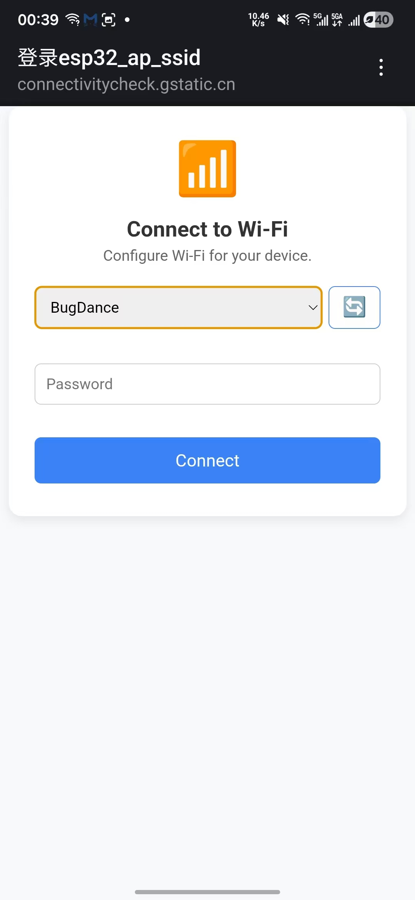

# esp_wifi_portal
## Overview
ESP-IDF component that provides a lightweight web portal for Wi-Fi provisioning, allowing users to scan networks, enter credentials, and connect IoT devices without hardcoding SSIDs or passwords.

## Features
- Provide a web portal for Wi-Fi provisioning
- Scan available Wi-Fi networks
- Enter SSID and password for provisioning
- Monitor connection status



## Usage

Add this component to your project by adding this below to your `main/idf_component.yml` file.

```yaml
dependencies:
  esp_wifi_portal:
    git: https://github.com/lz00qs/esp_wifi_portal.git
```

Example code:
```c
void app_main(void)
{
    ESP_ERROR_CHECK(esp_netif_init());
    ESP_ERROR_CHECK(esp_event_loop_create_default());

    //Initialize NVS
    esp_err_t ret = nvs_flash_init();
    if (ret == ESP_ERR_NVS_NO_FREE_PAGES || ret == ESP_ERR_NVS_NEW_VERSION_FOUND) {
        ESP_ERROR_CHECK(nvs_flash_erase());
        ret = nvs_flash_init();
    }
    ESP_ERROR_CHECK(ret);

    ESP_ERROR_CHECK(esp_wifi_portal_init());
}
```

## API
- `esp_err_t esp_wifi_portal_init(void)`: Initialize the Wi-Fi portal.
- `esp_err_t esp_wifi_portal_deinit(void)`: Deinitialize the Wi-Fi portal.
- `esp_err_t esp_wifi_portal_start(void)`: Start the Wi-Fi portal.
- `esp_err_t esp_wifi_portal_stop(void)`: Stop the Wi-Fi portal.
- `void esp_wifi_portal_set_auto_start(bool auto_start)`: Set whether the portal should start automatically when the station disconnects.

## Configuration
Use menuconfig to configure the component.

| Config Option | Type | Default | Description |
|---------------|------|---------|-------------|
| `ESP_WIFI_PORTAL_STA_RETRY_CNT` | int | 3 | Retry count when STA connects to AP fail. |
| `ESP_WIFI_PORTAL_AP_SSID` | string | "esp32_ap_ssid" | SSID (network name) to set up the AP with. |
| `ESP_WIFI_PORTAL_AP_PASSWORD` | string | "esp32_ap_pwd" | Password (WPA/WPA2) for the AP. |
| `ESP_WIFI_PORTAL_AP_IP` | string | "192.168.4.1" | IP address to set up the AP with. Depends on `!ESP_WIFI_PORTAL_AP_ENHANCED_CAPTIVE`. |
| `ESP_WIFI_PORTAL_AP_NETMASK` | string | "255.255.255.0" | Netmask to set up the AP with. Depends on `!ESP_WIFI_PORTAL_AP_ENHANCED_CAPTIVE`. |
| `ESP_WIFI_PORTAL_AP_GATEWAY` | string | "192.168.4.1" | Gateway to set up the AP with. Depends on `!ESP_WIFI_PORTAL_AP_ENHANCED_CAPTIVE`. |
| `ESP_WIFI_PORTAL_AP_ENHANCED_CAPTIVE` | bool | y | Enable enhanced captive portal for the AP. Set IP to 8.8.8.8 to solve Android captive portal issue. Depends on `ESP_WIFI_PORTAL_ENABLE_DHCP_CAPTIVE_PORTAL`. |
| `ESP_WIFI_PORTAL_ENABLE_DHCP_CAPTIVE_PORTAL` | bool | y | Enables DHCP-based Option 114 to provide clients with the captive portal URI. |
| `ESP_WIFI_PORTAL_MAX_SCAN_CONN` | int | 8 | Max number of scan connections. |

## License
This project is licensed under the Apache License 2.0. See the [LICENSE](LICENSE) file for details.